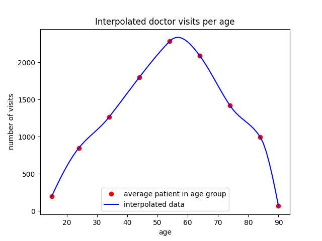

# TuK2 Winter Term 2017 / 2018: Exercise 1

## Task 1

> Load practice fusion CSV files into HANA as column tables
>
> Geospatial analyses: KPI per state (implemented as interactive map)
> - Number of patients, number of doctor visits
>   - Absolute numbers
>   - Relative to population of state
> - Average BMI (body mass index)
> - Smoker status
> - ...
> - Filterable by year and gender

To make it run do the following:

1. `cp db-conf.sample.json db-conf.json`
1. Change password in `db-conf.json`
1. Change directory: `cd task1`
1. Run `python3 generate-map.py [GENDER] [START_YEAR] [END_YEAR]` (`GENDER` is `M` or `F`)
1. Have a look at the beautiful `.html` maps

The maps are generated with Folium and Leaflet. See: [https://github.com/python-visualization/folium](https://github.com/python-visualization/folium).

The results are shown below.

### Doctor Visits


Generated by the following query:

```sql
DROP VIEW "TUKGRP7"."Visits";

CREATE VIEW "Visits" AS (
    SELECT T."PatientGuid", COUNT(T."TranscriptGuid") AS "Visits"
    FROM
       "TUKGRP7"."Transcript" AS T INNER JOIN "TUKGRP7"."Patient" AS P
        ON T."PatientGuid" = P."PatientGuid"
    WHERE <filtering_by_gender_and_year_here>
    GROUP BY T."PatientGuid");

SELECT "State", AVG("Visits")
FROM
    "TUKGRP7"."Visits" AS V INNER JOIN "TUKGRP7"."Patient" AS P
    ON V."PatientGuid" = P."PatientGuid"
GROUP BY "State";
```

### Patients


Generated by the following query:

```sql
SELECT P."State", COUNT(P."State")
FROM
    "TUKGRP7"."Patient" AS P INNER JOIN "TUKGRP7"."Transcript" AS T
    ON P."PatientGuid" = T."PatientGuid"
WHERE <filtering_by_gender_and_year_here>
GROUP BY P."State"
```

### BMI


Generated by the following query:

```sql
SELECT P."State", AVG("BMI")
FROM
    "TUKGRP7"."Patient" AS P INNER JOIN "TUKGRP7"."Transcript" AS T
    ON P."PatientGuid" = T."PatientGuid"
WHERE <filtering_by_gender_and_year_here>
GROUP BY P."State"
```

### Smoking Status

Unfortunately we can not generate maps showing information about smoking status because we can not quantify this with the given data. There are too many factors to be considered to map this on a linear range. The database does not provide an order or smoking status and the NIST codes do not help, unfortunately.

## Task 2

### Step 1

> Determine the most common diseases and their distributions among age groups (line chart for 10 most common diagnoses)

This is done by `most-common-diseases.py`. Run `python3 most-common-diseases.py` to generate the following chart:


This is done by the following query:

```sql
DROP VIEW "TUKGRP7"."Top10Diseases";

CREATE VIEW "Top10Diseases" AS (
    SELECT "ICD9Code", COUNT("DiagnosisGuid") AS "Occurences"
    FROM "TUKGRP7"."Diagnosis"
    GROUP BY "ICD9Code"
    ORDER BY "Occurences" DESC
    LIMIT 10);

SELECT
    D."ICD9Code",
    P."YearOfBirth",
    COUNT(D."PatientGuid") AS "Occurences"
FROM
    "TUKGRP7"."Diagnosis" AS D INNER JOIN "TUKGRP7"."Patient" AS P
    ON D."PatientGuid" = P."PatientGuid"
WHERE "ICD9Code" IN (SELECT "ICD9Code" FROM "TUKGRP7"."Top10Diseases")
GROUP BY D."ICD9Code", P."YearOfBirth"
ORDER BY D."ICD9Code", P."YearOfBirth" ASC;
```

### Step 2

> Determine the overall 10 most common diseases that appear together
> - We assume that two diseases appear together if they are diagnosed for the same patient in the same year
> - The analysis should be done via a single SQL statement
> - Please report the runtime of the query
> - Read about ICD-9 codes (you may want to group diseases)

The SQL queries can be found in `diseases_co-occurrence_icd9.sql` (diseased referenced by ICD9 code) and `diseases_co-occurrence_description.sql` (diseased referenced by description). These files also contain the runtime of the queries as a comment. Results are to be found in the corresponding CSV files.

Query by ICD9 code:

```sql
SELECT D1."ICD9Code", D2."ICD9Code", COUNT(*) AS "Occurrence"
FROM
    "TUKGRP7"."Diagnosis" AS D1 INNER JOIN "TUKGRP7"."Diagnosis" AS D2
    ON  D1."PatientGuid" = D2."PatientGuid"
    AND D1."StartYear" = D2."StartYear"
    AND D1."StartYear" != 0
    AND D1."ICD9Code" < D2."ICD9Code"
GROUP BY D1."ICD9Code", D2."ICD9Code"
ORDER BY "Occurrence" DESC
LIMIT 10

/* server processing time: 73 ms 943 µs */
```

Result:

```
  ;ICD9Code;ICD9Code;Occurrence
1 ;272.2   ;401.1   ;77        
2 ;272.4   ;401.9   ;63        
3 ;461.9   ;786.2   ;57        
4 ;466.0   ;786.2   ;52        
5 ;272.2   ;401.9   ;46        
6 ;401.9   ;477.9   ;43        
7 ;401.9   ;530.81  ;43        
8 ;461.9   ;466.0   ;38        
9 ;244.9   ;401.9   ;36        
10;272.2   ;530.81  ;33        
```

Query by description:

```sql
SELECT D1."DiagnosisDescription", D2."DiagnosisDescription", COUNT(*) AS "Occurrence"
FROM
    "TUKGRP7"."Diagnosis" AS D1 INNER JOIN "TUKGRP7"."Diagnosis" AS D2
    ON  D1."PatientGuid" = D2."PatientGuid"
    AND D1."StartYear" = D2."StartYear"
    AND D1."StartYear" != 0
    AND D1."DiagnosisDescription" < D2."DiagnosisDescription"
GROUP BY D1."DiagnosisDescription", D2."DiagnosisDescription"
ORDER BY "Occurrence" DESC
LIMIT 10

/* server processing time: 89 ms 845 µs */
```

Result:

```
  ;DiagnosisDescription                ;DiagnosisDescription              ;Occurrence
1 ;Benign essential hypertension       ;Mixed hyperlipidemia              ;77        
2 ;Other and unspecified hyperlipidemia;Unspecified essential hypertension;63        
3 ;Acute sinusitis, unspecified        ;Cough                             ;57        
4 ;Acute bronchitis                    ;Cough                             ;52        
5 ;Mixed hyperlipidemia                ;Unspecified essential hypertension;46        
6 ;Allergic rhinitis, cause unspecified;Unspecified essential hypertension;43        
7 ;Esophageal reflux                   ;Unspecified essential hypertension;43        
8 ;Acute bronchitis                    ;Acute sinusitis, unspecified      ;38        
9 ;Unspecified essential hypertension  ;Unspecified hypothyroidism        ;36        
10;Esophageal reflux                   ;Mixed hyperlipidemia              ;33  
```

### Step 3

> Determine the two most common diseases per ICD-9 code range ([https://en.wikipedia.org/wiki/List_of_ICD-9_codes](https://en.wikipedia.org/wiki/List_of_ICD-9_codes)) that appear together

Call with `python3 cooccurrence_per_code_range.py` from `task2` directory.

Result:

```shell
001–139: infectious and parasitic diseases
    110.1 and 110.4 appearing together 2 times.
140–239: neoplasms
    216.9 and 238.2 appearing together 1 times.
240–279: endocrine, nutritional and metabolic diseases, and immunity disorders
    268.9 and 272.2 appearing together 29 times.
280–289: diseases of the blood and blood-forming organs
    280 and 281.1 appearing together 4 times.
290–319: mental disorders
    300.02 and 305.90 appearing together 20 times.
320–389: diseases of the nervous system and sense organs
    380.10 and 380.4 appearing together 8 times.
390–459: diseases of the circulatory system
    401.9 and 427.31 appearing together 9 times.
460–519: diseases of the respiratory system
    461.9 and 466.0 appearing together 38 times.
520–579: diseases of the digestive system
    530.81 and 553.3 appearing together 6 times.
580–629: diseases of the genitourinary system
    626.0 and 626.4 appearing together 6 times.
630–679: complications of pregnancy, childbirth, and the puerperium
    642.33 and 643.03 appearing together 1 times.
680–709: diseases of the skin and subcutaneous tissue
    690.10 and 691.8 appearing together 5 times.
710–739: diseases of the musculoskeletal system and connective tissue
    723.1 and 724.2 appearing together 23 times.
780–799: symptoms, signs, and ill-defined conditions
    786.05 and 786.07 appearing together 16 times.
800–999: injury and poisoning
    825.0 and 928.20 appearing together 12 times.
E: external causes of injury
    E884 and E884.9 appearing together 2 times.
V: supplemental classification
    V04.81 and V70.0 appearing together 31 times.
```

Queried by:

```sql
SELECT "PatientGuid", "StartYear", "ICD9Code"
FROM "TUKGRP7"."Diagnosis"
WHERE "StartYear" != 0;
```

With python post-processing applied on the query result.

## Task 3

> Working on aggregated data:
>
> - Calculate the doctor visits per age group (0-9, 10-19, etc.) and visualize the data points. Further, use an interpolation method to estimate the doctor visits for each age. Compare the interpolated data with the actual data and calculate the mean squared error (MSE) & visualize.
>
> Model the blood pressure using linear regression:
> - Use the explanatory variables: smoking status, BMI, age (, and ...)
> - Determine the coefficient of determination R 2 for your regression.

Run "python createCharts.py" with Python 3 to create following plots:

First part:
- total doctor visits of different age groups:
The average age for e.g. the age group 0 - 9 is four years and those people will visit doctors in average 1/10 of the total number of visits of that age group. Those average patients are marked with a red dot. Their data gets interpolated to show visits per age:


- through those data get the interpolated doctor visits per age


- comparance of the interpolated and the real values: The data gets compared to the actual data: The achieved Mean Squared Error is about 112950 and the Root Mean Squared Error about 336:


Second part:

We used 90% of the data to train and 10% to test our model for both Diastolic and Systolic Blood Pressure. The plots show the whole testing data or only 100 data points to have a more detailed look.
The achieved R^2 for Systolic Blood Pressure was 0.0282854713335, for Diastolic Blood Pressure  0.021655668377:


Plots for systolic blood pressure:
- a comparance of predicted blood pressure data (through Smoking Status, BMI and Age) and the actual data (for 20% of the whole data set):


- a zoomed in plot with only 100 data points:


Plots for diastolic blood pressure:


By additionally using the Height, Weight, Respiratory Rate, Heart Rate and Temperature data of patients the achieved R^2 for Systolic Blood Pressure raised to 0.0437444633807, for Diastolic Blood Pressure to 0.0525840805308. This coefficient of determination is still quite low, but makes totally sense because there are way more factors that can influence the blood pressure of a patient. The model averages its predictions around a healthy blood pressure of about 120 to 80. This means we can’t predict exact blood pressures with the given data:

Plots for systolic blood pressure:
- a comparance of predicted blood pressure data (through Smoking Status, BMI, Age, Height, Weight, Respiratory Rate, Heart Rate and Temperature) and the actual data (for 20% of the whole data set):


- a zoomed in plot with only 100 data points:


Plots for diastolic blood pressure:


